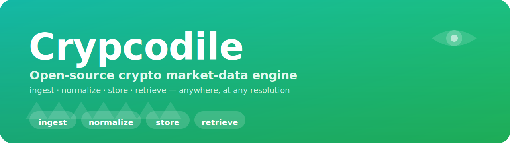
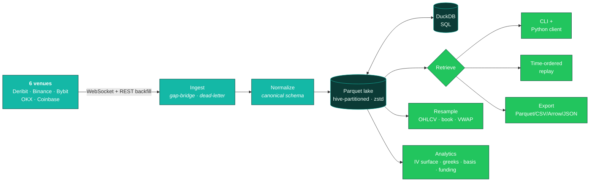

<div align="center">



<br/>

**Ingest, normalize, store, and retrieve crypto market data — anywhere, at any resolution.**
One canonical schema across six venues, a local Parquet lake you own, and options analytics built in.

<br/>

[](https://www.python.org/)
[](LICENSE)
[](tests/)
[](pyproject.toml)
[](pyproject.toml)
[](#-stack)

<br/>

[**Get started**](#-quickstart) · [**Why Crypcodile**](#-why-crypcodile) · [**Performance**](#-performance) · [**Examples**](examples/) · [**Docs**](docs/superpowers/specs/)

</div>

---

Crypcodile is a self-hosted crypto market-data engine that aims for coverage as deep as
**Tardis.dev**, **Amberdata**, and **Laevitas** — except it runs on your machine, writes to
**your** Parquet lake, and is free and open source. Stream live ticks or backfill history,
normalize everything to one schema, and query it all back with DuckDB SQL.

| | |
|---|---|
| 🌊 **Ingest** | Live WebSocket + historical REST from Deribit, Binance (spot & USD-M), Bybit, OKX, Coinbase. |
| 🧬 **Normalize** | One canonical schema for trades, L2 book, tickers, funding, OI, liquidations, options & OHLCV. |
| 🗄️ **Store** | Hive-partitioned Parquet (zstd) with a DuckDB SQL layer — **~20× smaller than JSON**, queryable in milliseconds. |
| 🔁 **Retrieve** | Python client + CLI · time-ordered replay · SQL · export to Parquet / CSV / Arrow / JSON / JSONL. |
| ⏱️ **Resample** | OHLCV bars at any interval (`1s`→`1w`), periodic book snapshots, VWAP & dollar-volume — on demand from raw ticks. |
| 📈 **Analyze** | IV surface, greeks, skew, term structure, basis, funding APR, 25Δ risk-reversal & butterfly — all offline. |

## 🐊 How it works



Every record carries **dual nanosecond timestamps** (`exchange_ts` + `local_ts`), so replay and
resampling are deterministic regardless of network jitter.

## 🆚 Why Crypcodile

Commercial data vendors are excellent — and metered, cloud-locked, and proprietary. Crypcodile
gives you the same shape of data on infrastructure you control.

| | **Crypcodile** | Tardis.dev | Amberdata | Laevitas |
|---|:---:|:---:|:---:|:---:|
| **Open source** | ✅ Apache-2.0 | ❌ | ❌ | ❌ |
| **Self-hosted / your hardware** | ✅ | ❌ | ❌ | ❌ |
| **Price** | 🆓 Free | 💳 Paid | 💳 Enterprise | 💳 Subscription |
| **You own the raw data lake** | ✅ Parquet on disk | vendor-hosted | API access | dashboard/API |
| **Tick trades + L2 order book** | ✅ | ✅ | ✅ | partial |
| **Derivatives (funding / OI / liq)** | ✅ | ✅ | ✅ | ✅ |
| **Options analytics (IV / greeks / skew)** | ✅ built-in | raw data | ✅ | ✅ |
| **Any-resolution resample on demand** | ✅ | downloads | API | dashboard |
| **Local SQL engine (DuckDB)** | ✅ | — | — | — |
| **Add your own exchange** | ✅ write a connector | ❌ | ❌ | ❌ |

<sub>Comparison reflects the open-source / self-hosted model vs. commercial providers; competitor
capabilities are summarized from their public product information.</sub>

## ⚡ Performance

Real numbers from the committed, **network-free** benchmark (`benchmarks/bench.py`) on synthetic
data. Throughput figures are quoted at conservative run-to-run lows; storage figures are
deterministic.

| Stage | Result |
|---|---:|
| Normalize raw messages → canonical records | **≈ 2M records/s** |
| Write to Parquet lake (zstd-5) | **≈ 230K records/s** |
| On-disk footprint | **12.2 bytes/trade** · ~20× smaller than JSON |
| DuckDB `GROUP BY` aggregate over 500K rows | **≈ 5 ms** |
| DuckDB `count(*)` over 500K rows | **< 1 ms** |
| Resample 500K trades → 1-min OHLCV | **≈ 30 ms** |
| Time-ordered replay (k-way merge) | **≈ 360K records/s** |

<sub>Apple Silicon (arm64, 10 cores) · Python 3.12 · Polars 1.41 · DuckDB 1.5 · PyArrow 24.
Reproduce: <code>uv run python benchmarks/bench.py</code> → <a href="benchmarks/RESULTS.md">benchmarks/RESULTS.md</a>.</sub>

<details>
<summary><b>Benchmark methodology &amp; honest caveats</b></summary>

<br/>

These are **engine** numbers, measured offline on a single Apple-Silicon machine — not a
head-to-head against the commercial vendors (their SaaS can't be benchmarked locally). All stages
run on seeded synthetic data with no network, so anyone can reproduce them.

- **Normalize** measures the in-process dict → canonical-`Record` transform only (no JSON parse / no
  websocket). Most run-to-run variable stat (observed ~1.9M–3.6M rec/s); quoted at ≈2M.
- **Compression (20×)** compares on-disk zstd-5 Parquet against the same logical rows JSON-encoded.
  The synthetic stream is a single instrument with a smooth random walk, which compresses better
  than a multi-symbol production mix — treat 12.2 bytes/trade as a best-case single-instrument
  figure (it is identical every run because it depends only on the seeded data).
- **Query latency** is warm-cache (median of 7 runs after a warmup); first-touch cold latency is
  higher. `count(*)` benefits from Parquet metadata.
- **Resample / replay** throughput is whole-stage wall-clock; replay includes per-record Python
  object construction, which dominates its cost.

Numbers differ on x86/Linux. See the [full results](benchmarks/RESULTS.md).

</details>

## 🚀 Quickstart

### 1. Install

```bash
git clone https://github.com/nazmiefearmutcu/Crypcodile.git
cd Crypcodile

# Install everything (Python 3.12 pinned) with uv
uv sync

# The package installs a `crypcodile` CLI — verify it:
uv run crypcodile --help
```

### 2. Collect live data

Stream `BTC-PERPETUAL` trades + book deltas from Deribit into a local data lake under `./data/`:

```bash
uv run crypcodile collect \
  --exchange deribit \
  --symbols BTC-PERPETUAL \
  --channels trade book_delta derivative_ticker \
  --data-dir data
```

The lake is hive-partitioned Parquet, so it's just files you can copy, back up, or query directly:

```
data/exchange=deribit/channel=trade/date=2024-01-15/bucket=42/part-<uuid>.parquet
```

### 3. Query with DuckDB SQL

```bash
# Top 5 most-traded symbols by volume
uv run crypcodile query \
  "SELECT symbol, sum(amount) AS volume FROM trade GROUP BY symbol ORDER BY volume DESC LIMIT 5" \
  --data-dir data
```

```python
from crypcodile.client.client import CrypcodileClient

client = CrypcodileClient(data_dir="data")
print(client.query("SELECT count(*) FROM trade"))
```

### 4. Base On-Chain DEX Collection

You can stream live Base on-chain DEX (Uniswap V3 and Aerodrome V2) updates directly. Configure the RPC URLs via the `BASE_RPC_URL` (single endpoint) or `BASE_RPC_URLS` (comma-separated list for automatic failover) environment variable:

```bash
# Run the showcase script with RPC failover support
BASE_RPC_URLS="https://base-rpc.publicnode.com,https://developer-access-mainnet.base.org" uv run python examples/collect_base_onchain.py --symbol cbBTC-USDC

# Or run a quick offline dry-run to test end-to-end wiring:
uv run python examples/collect_base_onchain.py --dry-run
```

<details>
<summary><b>🔁 Replay &amp; export</b></summary>

<br/>

The replay engine k-way-merges stored partitions by `local_ts` across channels and symbols
**without loading everything into memory**.

```bash
# First 20 BTC-PERPETUAL trades in time order
uv run crypcodile replay \
  --channels trade --symbols deribit:BTC-PERPETUAL \
  --from 0 --to 9223372036854775807 --limit 20 --data-dir data
```

```python
client = CrypcodileClient(data_dir="data")
for record in client.replay(
    channels=["trade"], symbols=["deribit:BTC-PERPETUAL"],
    frm=0, to=9_223_372_036_854_775_807,
):
    print(record)
```

Export a time range to CSV / Parquet / Arrow IPC / JSON / JSONL:

```bash
uv run crypcodile export \
  --channel trade --symbols deribit:BTC-PERPETUAL \
  --from 0 --to 9223372036854775807 \
  --fmt csv --dest trades.csv --data-dir data
```

```python
client.export(
    channel="trade", symbols=["deribit:BTC-PERPETUAL"],
    frm=0, to=9_223_372_036_854_775_807, fmt="csv", dest="trades.csv",
)
```

</details>

<details>
<summary><b>⏱️ Resample &amp; reconstruct the order book</b></summary>

<br/>

Resample stored trades into OHLCV bars at any interval — no exchange calls, all from the DuckDB
catalog:

```python
from crypcodile.store.catalog import Catalog
from crypcodile.resample.ohlcv import resample_ohlcv
from crypcodile.resample.metrics import resample_metrics

catalog = Catalog("data")
END = 9_223_372_036_854_775_807

ohlcv   = resample_ohlcv(catalog, "deribit:BTC-PERPETUAL", 0, END, "1m")    # OHLCV bars
metrics = resample_metrics(catalog, "deribit:BTC-PERPETUAL", 0, END, "5m")  # VWAP + $-volume
```

Supported intervals: `1s` `5s` `30s` `1m` `5m` `15m` `30m` `1h` `4h` `1d` `1w`.

Reconstruct periodic book snapshots from stored deltas:

```python
from crypcodile.client.client import CrypcodileClient
from crypcodile.resample.book import resample_book_snapshots
from crypcodile.schema.records import BookSnapshot, BookDelta

client = CrypcodileClient(data_dir="data")
records = list(client.replay(
    channels=["book_snapshot", "book_delta"],
    symbols=["deribit:BTC-PERPETUAL"], frm=0, to=END,
))

for snap in resample_book_snapshots(
    [r for r in records if isinstance(r, (BookSnapshot, BookDelta))],
    interval_ns=1_000_000_000, top_n=5,   # a snapshot every 1s, top-5 levels
):
    print(snap)
```
</details>

## Analytics 📈

Derive options & funding metrics straight from your Parquet lake — **IV surface, greeks, skew,
term structure, basis, and funding APR** — all computation **offline**, with no new exchange calls.
Everything is also exposed as `CrypcodileClient` methods.


<details>
<summary><b>Funding, basis & IV surface — full examples</b></summary>

<br/>

The `crypcodile.analytics` package derives metrics straight from the Parquet lake — no new exchange
calls, all computation offline. Everything is also exposed as `CrypcodileClient` methods.

**Funding APR** (annualized per-event perpetual funding + cumulative):

```python
from crypcodile.analytics.funding import funding_apr, funding_summary

df      = funding_apr(catalog, "deribit:BTC-PERPETUAL", 0, END)
summary = funding_summary(catalog, "deribit:BTC-PERPETUAL", 0, END)
```

**Basis** — spot-future (DuckDB ASOF JOIN, annualized with `expiry_ns`) and perpetual (mark vs index):

```python
from crypcodile.analytics.basis import spot_future_basis, perp_basis

sf   = spot_future_basis(catalog, "deribit:BTC-FUTURE", "binance-spot:BTCUSDT", 0, END)
perp = perp_basis(catalog, "deribit:BTC-PERPETUAL", 0, END)
```

**IV surface, skew & term structure** — IV from exchange `mark_iv` when present, else solved via
Black-76:

```python
from crypcodile.analytics.volsurface import iv_surface, vol_skew, term_structure

AT_NS     = 1_704_067_200_000_000_000   # 2024-01-01 00:00 UTC
EXPIRY_NS = 1_735_689_600_000_000_000

surface = iv_surface(catalog, "BTC", AT_NS)                 # expiry × strike × IV
skew    = vol_skew(catalog, "BTC", EXPIRY_NS, AT_NS)        # strike × delta × IV
ts      = term_structure(catalog, "BTC", AT_NS)             # ATM IV per expiry
```

Via the client, including 25Δ risk-reversal / butterfly:

```python
client  = CrypcodileClient("data")
skew_df = client.vol_skew("BTC", EXPIRY_NS, AT_NS)
rr, bf  = client.risk_reversal_butterfly(skew_df)
```

Or run the end-to-end example scripts:

```bash
uv run python examples/analytics_funding.py    --symbol deribit:BTC-PERPETUAL --data-dir data
uv run python examples/analytics_iv_surface.py --underlying BTC --data-dir data
```

CLI equivalents: `crypcodile funding-apr`, `crypcodile basis`, `crypcodile iv-surface`,
`crypcodile term-structure`.

</details>

## 🔌 Supported exchanges & channels

Every venue below has a real live connector wired to `collect` (WebSocket ingest + historical
backfill where the exchange supports it).

| Exchange | Venue key | Trades | L2 book | Tickers | Funding | OI | Liq | Options |
|---|---|:---:|:---:|:---:|:---:|:---:|:---:|:---:|
| Deribit | `deribit` | ✅ | ✅ | ✅ | ✅ | ✅ | ✅ | ✅ |
| Binance spot | `binance-spot` | ✅ | ✅ | ✅ | — | — | — | — |
| Binance USD-M | `binance-usdm` | ✅ | ✅ | ✅ | ✅ | ✅ | ✅ | — |
| Bybit | `bybit` | ✅ | ✅ | ✅ | ✅ | ✅ | ✅ | — |
| OKX | `okx` | ✅ | ✅ | ✅ | ✅ | ✅ | ✅ | — |
| Coinbase | `coinbase` | ✅ | ✅ | ✅ | — | — | — | — |
| Base On-Chain | `base_onchain` | ✅ | ✅ | ✅ | — | — | — | — |


## 🧱 Stack

Python 3.12+ · `asyncio` · **msgspec** (hot-path) · **Polars** · **PyArrow** · **DuckDB** ·
`websockets` / `aiohttp` · **Typer** + **Rich** · Apache-2.0.

```
src/crypcodile/
├── schema/        canonical records + enums (dual-ns timestamps)
├── exchanges/     deribit · binance · bybit · okx · coinbase (connector + normalize + backfill)
├── ingest/        run-loop, transport, gap-bridge, dead-letter
├── instruments/   instrument registry
├── sink/ store/   Parquet sink + DuckDB catalog (hive-partitioned, zstd)
├── replay/        k-way merge + order-book reconstruction
├── resample/      OHLCV · book snapshots · VWAP / $-volume metrics
├── analytics/     black-scholes · volsurface · basis · funding
├── client/        CrypcodileClient + collect/export
└── cli.py         the `crypcodile` command (Typer)
```

## 🛠️ Development

```bash
uv sync                                              # install dev deps into .venv
uv run pytest                                        # 765 tests
uv run ruff check .                                  # lint
uv run mypy                                          # strict type-check
uv run pytest --cov=crypcodile --cov-report=term-missing
uv run python benchmarks/bench.py                    # reproduce the performance table
```

## 🤖 AI Agent & On-Chain Tools (MCP & x402)

Crypcodile supports direct AI agent integrations and agentic monetization standards out-of-the-box.

### 1. Model Context Protocol (MCP) Server
AI agents (e.g. Claude Code, Google Antigravity) can connect to Crypcodile as a standard MCP server to execute queries and retrieve real-time and historical market data.
*   **Start the MCP Server:**
    ```bash
    uv run crypcodile mcp --data-dir data
    ```
*   **Available Tools:**
    *   `get_onchain_price(symbol)`: Query live Base mainnet DEX pool state (AERO-USDC, cbBTC-USDC, DEGEN-WETH, WELL-WETH).
    *   `query_market_data(sql)`: Run arbitrary DuckDB SQL queries against the local Parquet data lake.
    *   `get_funding_apr(symbol, start, end)`: Calculate perpetual funding rates.

### 2. x402 Micropayments Gated API
A demo FastAPI web server that gates Base DEX data requests behind the **x402 Micropayment Protocol** (HTTP `402 Payment Required` standard for autonomous agents).
*   **Start the API Server:**
    ```bash
    uv run crypcodile api --port 8000
    ```
*   **Client Flow:**
    1.  Call `GET /api/v1/market-data?symbol=AERO-USDC`.
    2.  Receive `HTTP 402` and the `Payment-Required` header details.
    3.  Submit payment and resubmit the request with the on-chain `Payment-Signature` header.
    4.  Verify and receive `HTTP 200` with the live DEX dataset.


## 🗺️ Roadmap

- ✅ **Core** — ingestion → normalization → storage → client / export / replay / resample.
- ✅ **Analytics** — IV surface, greeks, skew, term structure, basis, funding APR.
- 🔜 **Server API** — self-hosted REST + WebSocket.
- 🧭 **Dashboard** — visual exploration.

## 📄 License

[Apache-2.0](LICENSE).

<div align="center">
<sub>Built for people who'd rather own their market data than rent it. 🐊</sub>
</div>
