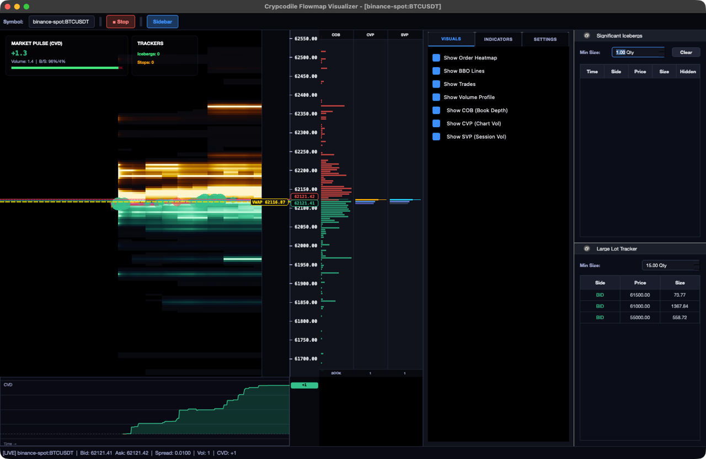
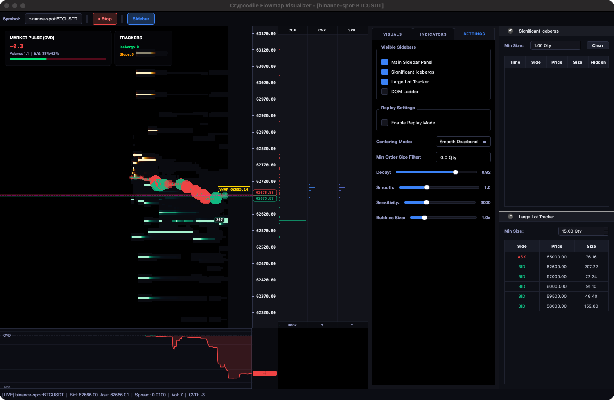

<p align="center"></p>

# Crypcodile

Crypto market-data engine with a deterministic core. It pulls order books,
trades, funding and on-chain DEX events from **100+ venues** — nine
hand-written native connectors plus the entire [ccxt](https://github.com/ccxt/ccxt)
universe behind one universal connector — into one Parquet + DuckDB data lake,
replays any slice of it byte-for-byte, and runs options and microstructure
analytics on top. It ships with **FlowMap**, a GPU order-flow visualizer, and
an **MCP server** so LLM agents can read real prices instead of inventing them.

Point it at a single symbol, or pull a whole exchange's market —
`crypcodile collect-market --exchange binance --top 200` resolves the 200
most-liquid pairs from the live universe and streams them all into the same
lake.

Python 3.12+, Apache-2.0. Public market data needs no API keys; on-chain
reads use a default Base RPC endpoint you can override.



## Install

```bash
uv pip install crypcodile     # or: pip install crypcodile
```

That gives you the core streaming engine: every CEX connector, the Parquet
lake, replay, and the CLI. The heavier surfaces live behind extras:

```bash
uv pip install 'crypcodile[market]'  # 100+ exchanges via the universal ccxt connector
uv pip install 'crypcodile[gui]'     # FlowMap visualizer + gas tracker (PyQt6/pyqtgraph)
uv pip install 'crypcodile[ml]'      # xgboost/scipy analytics (funding prediction, Black-Scholes)
uv pip install 'crypcodile[web]'     # FastAPI x402 API server + Streamlit examples
uv pip install 'crypcodile[onchain]' # Base L2 / GMX / Superchain connectors + MCP server (web3)
uv pip install 'crypcodile[full]'    # all of the above
```

One-shot installers if you prefer: [`install.sh`](install.sh) (macOS/Linux),
[`install.ps1`](install.ps1) (Windows). Both install `crypcodile[full]`, so
the desktop app works out of the box.

## First ten minutes

```bash
# stream Deribit BTC perp trades + book deltas into a local Parquet lake
crypcodile collect --exchange deribit --symbols BTC-PERPETUAL \
    --channels trade --channels book_delta --data-dir data

# ...or pull a whole exchange's market: the 100 most-liquid USDT spot pairs
# on Kraken, resolved live and streamed into the same lake ([market] extra)
crypcodile collect-market --exchange kraken --top 100 --quote USDT \
    --kind spot --channels trade --channels book_ticker

# see every venue you can reach (native connectors + 100+ ccxt exchanges)
crypcodile markets
# and the tradable universe of any one of them, ranked by volume
crypcodile universe binance --top 20 --quote USDT --kind spot

# find out what you actually have
crypcodile search "btc" --channel trade --exchange deribit
crypcodile data-coverage --symbol deribit:BTC-PERPETUAL --channel trade

# ask the lake anything — it's just DuckDB over partitioned Parquet
crypcodile query "SELECT count(*) FROM records WHERE channel='trade'"

# replay the same window later; identical bytes, every run
crypcodile replay --channels trade --symbols deribit:BTC-PERPETUAL

# open the order-flow visualizer on live Binance data
# (desktop app — needs the [gui] or [full] extra)
crypcodile flowmap --symbol binance-spot:BTCUSDT --historical-hours 2.0
```

There is also an interactive shell (`crypcodile shell`) with history and
tab-completion; every command works inside it. No lake yet? `replay` and
`query` fall back to the sample data in [`test_data/`](test_data/), so the
commands above work offline on a fresh clone.

## Commands

46 commands behind one binary. The clusters:

| Cluster | Commands |
|---|---|
| Lake | `collect` `collect-market` `backfill` `replay` `query` `export` |
| Discovery | `markets` `universe` `search` `resolve-symbols` `data-coverage` `catalog` `catalog-summary` `catalog-stats` `catalog-dates` `catalog-symbols` `catalog-inventory` `catalog-exchanges` `list-exchanges` |
| Options & funding | `iv-surface` `term-structure` `vol-skew` `risk-reversal` `funding-apr` `funding-predict` `basis` `open-interest` |
| Microstructure | `ofi` `slippage` `whale-alerts` `liquidity-depth` `indicators` |
| On-chain / L2 risk | `sequencer-latency` `peg-deviation` `chaos-score` `lending-stress` `gas-vol` `smart-money` `label-transfers` `mev-sandwich` |
| Desktop | `flowmap` `gas-tracker` |
| Servers | `mcp` `api` |
| Housekeeping | `shell` `update` |

Every venue sits behind the same record schema. Nine **native** connectors are
hand-written for maximum fidelity — Binance, Bybit, Coinbase, Deribit, OKX,
Base on-chain (Uniswap V3, Aerodrome), GMX/Synthetix, Derive and Superchain —
and one **universal** connector wraps the whole [ccxt](https://github.com/ccxt/ccxt)
family (100+ exchanges) so any of them normalizes into the exact same `Trade` /
`BookSnapshot` / `BookTicker` / `Funding` / `OHLCV` records. When a name exists
in both, the native connector wins. Ingest survives disconnects with
gap-bridging and a dead-letter queue
([`src/crypcodile/ingest/`](src/crypcodile/ingest/)); whatever made it to disk
is normalized, validated and replayable.

### Pulling the whole market

The ccxt connector is REST-poll-first (works on every venue) with an opt-in
ccxt.pro WebSocket path (`--use-ws`) where the exchange supports it. Name a
*slice of the market* and Crypcodile resolves the concrete symbols from the
live universe:

```bash
# every USDT perpetual on three venues at once, order books included
crypcodile collect-market --exchange bybit,okx,mexc --all \
    --quote USDT --kind perpetual --channels book_snapshot --limit 400

# rank a venue's universe by 24h volume (feeds --top / scripting)
crypcodile universe okx --top 50 --quote USDT --kind spot --symbols-only
```

## FlowMap



FlowMap paints resting book depth over time as a liquidity heatmap and layers
the rest of the tape on top: aggressor-colored trade bubbles, VWAP and BBO
tags, COB/CVP/SVP volume profiles, a cumulative-delta strip, DOM ladder, and
iceberg / large-lot trackers. Three data sources: live, lake replay, or a
built-in synthetic market for poking at the UI offline.

```bash
# needs the [gui] extra: uv pip install 'crypcodile[gui]'   (or [full])
crypcodile flowmap --symbol binance-spot:BTCUSDT --historical-hours 2.0
```

Rendering is `QOpenGLWidget` by default with a pure-NumPy density engine
behind it (force a backend with `FLOWMAP_RENDERER=opengl|cpu`). The uncapped
offscreen benchmark does 100+ FPS at 1920×1080 on Apple Silicon; the window
itself stays comfortably at vsync.

## Analytics

The same lake feeds a library of options and microstructure analytics, exposed
three ways: as CLI commands, as MCP tools, and as plain Python over a
`Catalog`. Two runnable examples in [`examples/`](examples/) show the shape:

```python
# examples/analytics_funding.py — perpetual funding, annualized
from crypcodile.analytics.funding import funding_apr
from crypcodile.store.catalog import Catalog

catalog = Catalog(data_dir="data")
df = funding_apr(catalog, "binance:BTCUSDT", from_ns, to_ns)   # → Polars DataFrame

# examples/analytics_iv_surface.py — Black-Scholes implied-vol surface
from crypcodile.analytics.volsurface import iv_surface

surface = iv_surface(catalog, "BTC", at_ns, rate=0.0)          # strike × expiry × IV
```

CLI equivalents: `crypcodile funding-apr --symbol binance:BTCUSDT` and
`crypcodile iv-surface --underlying BTC`. The full set spans OFI, slippage,
whale alerts, term structure, vol skew, risk reversal, spot–perp / spot–future
basis, open interest and the L2/DeFi-risk family — every one of them reading
the same normalized records, whether they came from a native connector or any
ccxt venue.

## For agents (MCP)

`crypcodile mcp --data-dir data` starts a Model Context Protocol server over
stdio. Every tool is read-only and deterministic — answers come from the lake
and the chain, not from the model's imagination.

- market data: `get_base_market_data` · `get_onchain_price` ·
  `query_market_data` (bounded DuckDB SQL)
- discovery: `search_symbols` · `list_symbols` · `resolve_symbols` ·
  `inventory_snapshot` · `data_coverage` · `catalog_summary` · `catalog_stats` ·
  `list_data_channels` · `list_dates` · `list_exchanges_on_disk` ·
  `list_registered_exchanges`
- analytics: OFI, slippage, whale alerts, IV surface / term structure /
  vol skew / risk reversal, funding APR + prediction, spot–perp and
  spot–future basis, open interest, liquidity depth, sequencer latency,
  peg deviation, lending stress, MEV sandwich detection, smart-money labels

Works with Claude, Cursor, or anything else that speaks MCP.

## REST API

`crypcodile api` serves the same lake over FastAPI (`/api/v1/*`), with a few
payment-gated demo routes:

| Group | Paths |
|---|---|
| Ops | `/health` `/status` `/version` `/exchanges` |
| Catalog | `/catalog/channels` `/catalog/search` `/catalog/inventory` `/catalog/scan` `/data-coverage` `/resolve-symbols` |
| Query | `POST /query` (bounded read-only SQL) |
| Derivatives | `/open-interest` `/funding-apr` `/funding-predict` `/basis` `/perp-basis` `/spot-future-basis` |
| Microstructure | `/indicators` `/ofi` `/whale-alerts` `/slippage` `POST /simulate-price-impact` |
| Options | `/iv-surface` `/term-structure` `/vol-skew` `/risk-reversal` |
| L2 / DeFi risk | `/liquidity-depth` `/sequencer-latency` `/chaos-score` `/peg-deviation` `/lending-stress` |
| Offline analytics | `POST /gas-vol` `/mev-sandwich` `/smart-money` `/label-transfers` |
| Gated demo | `GET /market-data` + `POST /simulate-payment` (x402) |

## Base L2

`BaseOnchainConnector` reads Uniswap V3 and Aerodrome swap/reserve events from
Base RPC logs and emits the same record types as the CEX connectors, so
cross-venue queries are one SQL statement instead of two codebases. Start
with [docs/base_quickstart.md](docs/base_quickstart.md); there is a Streamlit
dashboard and a Farcaster frame server under [`examples/`](examples/).

## Tests

```bash
uv sync --all-extras
pytest tests/ -v
```

1,764 test functions across 136 files, including a local mock RPC server for
degraded-network E2E runs (`tests/e2e/`), adversarial payload suites, and a
regression file fed by real exchange API anomalies (`test_empirical_bugs.py`).
`mypy --strict` and Ruff run on `src/`. CI-friendly: Qt and Matplotlib are
forced headless, and BLAS thread caps keep Apple Silicon imports fast.

## What it is not

- Not a trading bot. There is no order-execution path, on purpose.
- Not a hosted service. Everything runs on your machine, against your lake.
- FlowMap is a desktop app; it needs a display (the data pipeline doesn't).
- Options analytics need options data — point `iv-surface` at a lake with
  Deribit snapshots in it.

## Media

Slide decks (16:9 and 9:16) with real screenshots live in
[docs/media/promo/](docs/media/promo/) — use them for talks or posts.

## Contributing

PRs welcome. Read `CHANGELOG.md` for recent direction and make sure the E2E
and adversarial suites pass before opening one.

Apache-2.0 — see [LICENSE](LICENSE).
