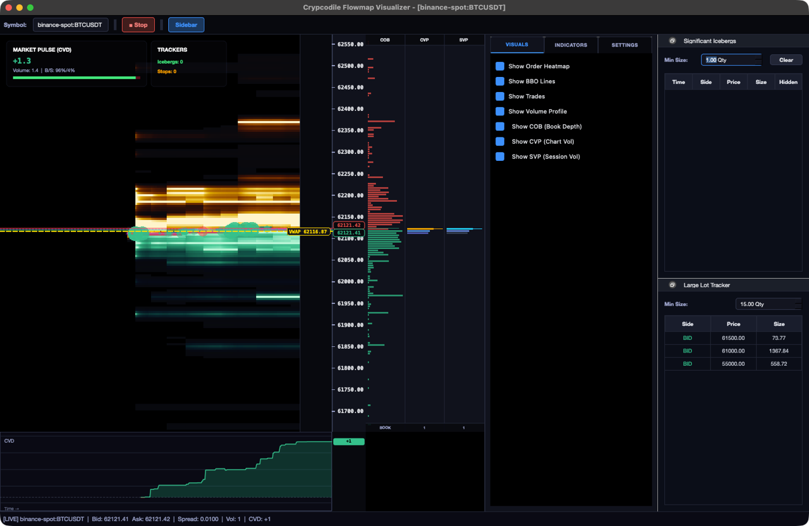
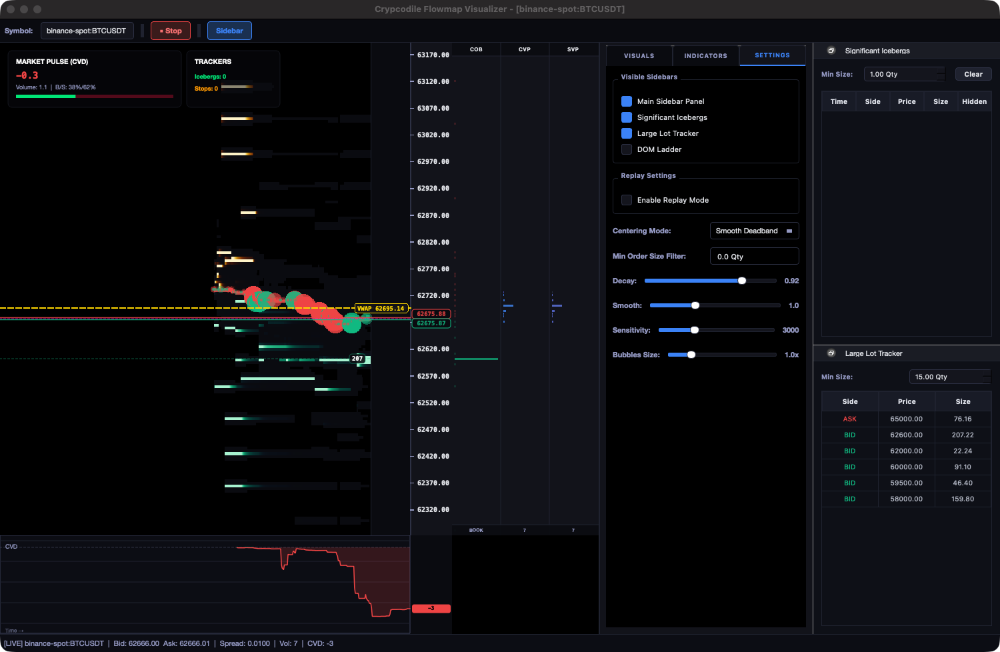

<p align="center"></p>

<h1 align="center">Crocodile</h1>

<p align="center"><b>A deterministic engine for crypto <i>and</i> US equities.</b><br>
Pull order books, trades, funding, option chains, filings and on-chain DEX events from
100+ venues and nine equity sources into one Parquet lake — then replay any slice of it
byte-for-byte.</p>

<p align="center"><sub>Python 3.12+ · Apache-2.0 · every keyless path works with no API keys</sub></p>

---

Every market-data tool can fetch a price. Three things make this one different.

**One schema for everything.** A hand-written Deribit connector, a ccxt Kraken venue, a
Uniswap V3 pool on Base and an SEC EDGAR Form 4 all emit the *same* record types. So a
question like "show me every trade across all my sources" is one SQL statement, not four
codebases.

**One capability, both markets.** Crocodile is the merge of two engines — Crypcodile for
crypto and Stockodile for equities — and both histories are in this repository's `git
log`. What came out is a single registry of **49 capabilities**, 42 of which answer for
both asset classes under one name and one parameter schema; the seven that do not each
carry a written argument for why no equity analogue can exist. The CLI, the REST API and
the MCP server are *projections* of that registry, so none of them can drift from it.

**The lake is deterministic, and it says where every number came from.** What lands on
disk is normalized, validated, and replayable — `replay` a window today or next year and
you get identical bytes. Every record also carries how it came to exist: a provenance
level, the method it rests on, and a confidence computed by a registered formula rather
than chosen by hand. A modelled answer says so before you read a row.

On top of that sits an options and microstructure analytics library, **FlowMap**
(a GPU order-flow visualizer), and an **MCP server** so LLM agents read real
prices instead of inventing them.



## Install

```bash
uv pip install crocodile          # or: pip install crocodile
```

The base install is the whole streaming core: every native connector, the
Parquet lake, replay, and the 64-command CLI. Heavier surfaces are opt-in extras
so you never pay for a dependency tree you don't use:

```bash
uv pip install 'crocodile[market]'   # +100 exchanges via the universal ccxt connector
uv pip install 'crocodile[gui]'      # FlowMap visualizer + gas tracker (PyQt6)
uv pip install 'crocodile[ml]'       # funding prediction + Black-Scholes (xgboost/scipy)
uv pip install 'crocodile[web]'      # FastAPI server + Streamlit examples
uv pip install 'crocodile[onchain]'  # Base L2 / GMX / Superchain connectors (web3)
uv pip install 'crocodile[full]'     # everything
```

Prefer one command? [`install.sh`](install.sh) (macOS/Linux) and
[`install.ps1`](install.ps1) (Windows) install `crocodile[full]`. Note they still
put the wrapper on your `PATH` under the old name, `crypcodile` — which is a real
console script, deprecated and removed in 0.4, that prints a notice on stderr and
forwards to the same CLI. Everything below is spelled `crocodile`.

## Five minutes

```bash
# stream Deribit BTC-perp trades + book deltas into a local lake
crocodile collect --asset-class crypto --sources deribit --symbols BTC-PERPETUAL \
    --channels trade --channels book_delta --data-dir data

# the lake is just partitioned Parquet — one DuckDB view per channel on disk
crocodile query --asset-class crypto "SELECT count(*) AS n FROM trade"

# replay that window later — identical bytes, every run
crocodile replay --asset-class crypto --channels trade --symbols BTC-PERPETUAL \
    --start-ns 0 --end-ns 9223372036854775807

# open the order-flow visualizer on live Binance data  ([gui] extra)
crocodile flowmap --symbol binance-spot:BTCUSDT --historical-hours 2.0
```

Three things in there are load-bearing and easy to get wrong:

- **`--sources`, not `--exchange`/`--provider`.** The merge collapsed the two
  forks' partitions into one `source=`, and the flag went with it. Lakes written
  under the old `exchange=` prefix are read by `crocodile migrate-lake` first.
- **`--asset-class` when the symbol does not name its market.** A bare
  `BTC-PERPETUAL` could be either fork's, and guessing is how a request lands in
  the wrong market's implementation and comes back with plausible numbers, so it
  refuses instead.
- **There is no `records` table.** The lake registers one view per `channel=`
  directory it finds — `trade`, `book_snapshot`, `ohlcv` — so the channel is the
  view name rather than a column. `crocodile catalog-channels` lists what a given
  lake actually has.

`replay` and `query` read the lake you point them at and nothing else; there is
no bundled sample and no offline fallback, so both answer empty on a fresh clone
until you have collected something. There's also an interactive shell —
`crocodile shell` — with history and tab-completion, and every command runs
inside it.

## Reaching the whole market

On the crypto side Crocodile speaks to **109 venues**: ten native connectors,
hand-written for fidelity, plus the entire [ccxt](https://github.com/ccxt/ccxt)
family behind one universal connector. When a name exists in both, the native
connector wins, so the total is a union rather than a sum — six names overlap.

The ccxt half is not a fixed number: the dependency is `ccxt>=4.5`, and 105 is
what the version resolved here ships. `crocodile markets --asset-class crypto`
prints the count your install actually has, and `crocodile census` reports it as
`connectors.total_reachable`.

| | Venues |
|---|---|
| **Native** | Binance · Bybit · Coinbase · Deribit · OKX · Base on-chain (Uniswap V3, Aerodrome) · GMX/Synthetix · Derive · Superchain · CoinGecko |
| **Universal** | every ccxt exchange id — Kraken, KuCoin, MEXC, Gate, HTX, Bitget, … |

On the equity side there are **nine sources**, and what each one may be asked for is
derived from the source itself rather than from a shared menu — so a channel is offered
for the providers that serve it and nowhere else:

| Source | Writes | Key |
|---|---|---|
| `alpaca` | `trade` `quote` `ohlcv` | yes |
| `yahoo` | `options_chain` `ohlcv` `corp_action` `insider` | no |
| `sec_edgar` | `insider` `holding_13f` `filing` `fundamental` | no (contact string) |
| `treasury` | `macro_series` | no |
| `tiingo` | `ohlcv` `corp_action` | yes (free tier) |
| `stooq` | `ohlcv` `index_value` | no |
| `msn_money` | `ohlcv` `corp_action` | no |
| `google_finance` | `trade` `index_value` `fundamental` | no |
| `finnhub` | `trade` | yes |

`openfigi` is deliberately not a source: it enriches an instrument universe and writes no
channel of its own.

You don't have to name symbols. Name a *slice of the market* and Crocodile
resolves the concrete list from the live universe:

```bash
# the 200 most-liquid spot pairs on Binance, streamed over a single WebSocket
crocodile collect-market --asset-class crypto --sources binance --top 200 \
    --kinds spot --use-ws --channels trade --channels book_ticker

# every USDT perpetual across three venues at once, order books included
crocodile collect-market --asset-class crypto --sources bybit,okx,mexc \
    --all-symbols --quote USDT --kinds perpetual --channels book_snapshot \
    --max-symbols 400

# the whole coin universe — 17k+ coins, including the long tail no CEX lists
crocodile collect --asset-class crypto --sources coingecko --symbols _ \
    --channels ohlcv
```

`--max-symbols`, not `--limit`: everywhere else in the CLI `--limit` caps rows
returned, and here it decided how much of a venue's market gets watched. Two
meanings for one flag on a command that opens sockets is worth a rename.

`--kinds` is written out above rather than left to default. Omitting it currently
fails (`'()' is not a valid Kind`) — an empty tuple default reaches the parameter
as the literal string, which also makes a bare `crocodile census` report zero
venues. Name the kinds explicitly until that is fixed.

Two design choices make that scale honestly. The ccxt path is **REST-poll-first**
(works on every venue) but upgrades to a **single multi-symbol WebSocket** per
channel where the exchange supports it (`watchTradesForSymbols` / `watchTickers`)
— the difference between one socket for three symbols and one socket for a whole
exchange's book. And `universe` ranks any venue's markets by live 24h volume, so
`--top N` covers the liquid core instead of ten thousand dead pairs.

### The whole market, on one screen

`crocodile census` measures the market live and prints one JSON document —
connector reach, venue market counts (ccxt), the coin universe + market cap +
dominance (CoinGecko), and total value locked (DeFiLlama). Every figure comes
from a keyless public feed. A run over the twelve major venues, 2026-07-28:

> **109** reachable venues · **34,208** markets across the majors ·
> **17,863** active coins · **$2.28T** market cap · **$75.4B** DeFi TVL

```bash
crocodile census --asset-class crypto \
    --venues binance,bybit,okx,coinbase,kraken,kucoin,mexc,gate,htx,bitget,bingx,cryptocom
```

Name the venues: a bare `crocodile census` reports zero of them today, for the
same empty-tuple reason as `--kinds` above, and zero venues is indistinguishable
from a census that ran and found nothing.

The census writes no file. It has no `--output`, and the HTML dashboard an
earlier version of this section described is gone — a flag that names a file to
write is a surface's business, not a capability's, so the capability returns the
document and you redirect it wherever you want it.

## The 64 commands

Three numbers describe the same CLI, and which one you want depends on the
question. **64** is what `--help` lists. **56** folds away eight retired
spellings kept resolving for callers already wired to them. **49** is the
capability registry — every command below except the seven launchers is a
projection of one declaration, which is also what the REST route and the MCP
tool are projections of.

| Cluster | Commands |
|---|---|
| **Lake** | `collect` · `collect-market` · `backfill` · `replay` · `query` · `export` · `resample` |
| **Discovery** | `census` · `markets` · `universe` · `search` · `resolve-symbols` · `data-coverage` · `list-exchanges` · `catalog` · `catalog-channels` · `catalog-dates` · `catalog-exchanges` · `catalog-inventory` · `catalog-scan` · `catalog-stats` · `catalog-summary` · `catalog-symbols` |
| **Options & funding** | `iv-surface` · `term-structure` · `vol-skew` · `risk-reversal` · `funding-apr` · `funding-predict` · `basis` · `perp-basis` · `spot-future-basis` · `open-interest` |
| **Microstructure** | `ofi` · `slippage` · `whale-alerts` · `liquidity-depth` · `depth` · `indicators` |
| **On-chain / L2 risk** | `sequencer-latency` · `peg-deviation` · `chaos-score` · `lending-stress` · `gas-vol` · `smart-money` · `label-transfers` · `mev-sandwich` · `onchain-price` · `base-market-data` |
| **Desktop** | `flowmap` · `gas-tracker` |
| **Servers** | `mcp` · `api` |
| **Operator** | `shell` · `update` · `migrate-lake` |
| **Retired spellings** | `inventory_snapshot` · `list_data_channels` · `list_dates` · `list_exchanges_on_disk` · `list_symbols` · `query_market_data` · `search_symbols` · `simulate-price-impact` |

The last row is a ledger that only shrinks. Each entry was on the wire under one
of the two forks and resolves to a single declaration, so there is never a second
implementation behind a second name.

Ingest survives disconnects with sequence-gap bridging and a dead-letter queue
([`src/crocodile/core/ingest/`](src/crocodile/core/ingest/)); whatever reaches disk is
normalized against the [30-record schema](src/crocodile/core/schema/records.py) and
replayable.

## FlowMap



FlowMap paints resting book depth over time as a liquidity heatmap and layers
the tape on top: aggressor-colored trade bubbles, VWAP and BBO tags,
COB/CVP/SVP volume profiles, a cumulative-delta strip, a DOM ladder, and
iceberg / large-lot trackers. Feed it live data, a lake replay, or a built-in
synthetic market for poking at the UI offline.

```bash
crocodile flowmap --symbol binance-spot:BTCUSDT --historical-hours 2.0
```

A pure-NumPy density engine draws it, and the window sits at vsync. There is no
render benchmark in the tree to quote a frame rate from — `benchmarks/bench.py`
measures the offline data path (normalize → store → query → resample → replay)
and nothing about the GUI, so the numbers in
[`benchmarks/RESULTS.md`](benchmarks/RESULTS.md) are the reproducible ones.

## Analytics

The lake feeds an options + microstructure library, reachable three ways — CLI,
MCP tool, or plain Python over a `Catalog`. Nine runnable scripts in
[`examples/`](examples/); the ones under "Base L2" below run against the live
chain and need no lake, the rest want one you have collected into:

```python
from crocodile.crypto.analytics.funding import funding_apr
from crocodile.crypto.analytics.volsurface import iv_surface
from crocodile.core.store.catalog import Catalog

catalog = Catalog(data_dir="data")
apr     = funding_apr(catalog, "BTCUSDT", from_ns, to_ns)  # Polars DataFrame
surface = iv_surface(catalog, "BTC", at_ns, rate=0.0)      # strike × expiry × IV
```

Symbols here are the venue's own spelling, as stored. The canonical `source:RAW`
form that the CLI reads to work out which market you mean is not what the lake's
`symbol` column holds, so passing `binance:BTCUSDT` to a reader matches nothing
and returns an empty frame rather than raising.

The full set spans OFI, slippage, whale alerts, term structure, vol skew, risk
reversal, spot–perp / spot–future basis, open interest, and an L2/DeFi-risk
family (sequencer latency, peg deviation, lending stress, MEV-sandwich
detection). Each reads the same normalized records — native venue or ccxt, it
can't tell the difference.

## For agents (MCP)

```bash
crocodile mcp --data-dir data     # Model Context Protocol server over stdio
```

Every tool is read-only and deterministic — answers come from the lake and the
chain, never the model's imagination. Tools cover market-data reads (bounded
DuckDB SQL, on-chain prices), catalog discovery (`search_symbols`,
`list_all_exchanges`, coverage, inventory), and the analytics library. Works
with Claude, Cursor, or anything that speaks MCP.

## REST API

`crocodile api` serves the same lake over FastAPI at `/api/v1/*` — ops and
catalog discovery, a bounded read-only `POST /query`, the derivatives and
microstructure analytics, and a payment-gated demo route over the x402 protocol.

## Base L2

`BaseOnchainConnector` reads Uniswap V3 and Aerodrome swap/reserve events from
Base RPC logs and emits the same record types as the CEX connectors, so a
cross-venue query is one SQL statement instead of two codebases. Start with
[docs/base_quickstart.md](docs/base_quickstart.md); there's a Streamlit
dashboard and a Farcaster frame server under [`examples/`](examples/). Public
data needs no keys; on-chain reads use a default Base RPC you can override.

## Tests

```bash
uv sync --all-extras
pytest tests/
```

2,512 test functions across 236 files, 3,307 cases once parametrisation expands
them: a local mock-RPC server for degraded-network E2E runs (`tests/e2e/`),
adversarial payload suites, a regression file seeded by real exchange API
anomalies, and `tests/conformance/`, which asserts the arguments this codebase
runs on rather than its behaviour. CI-friendly — Qt and Matplotlib run headless,
and BLAS thread caps keep imports fast on Apple Silicon.

Neither `mypy --strict` nor Ruff gates the whole of `src/`, and saying otherwise
was the more expensive kind of wrong — it described a gate nobody would re-derive.
What actually holds:

- **Zero Ruff findings** in `core`, `contrib`, `capabilities`, `surfaces` and the
  two deprecation shims — every line the merge wrote.
- **A ratchet, currently 222,** over `crypto` and `equity`, the two inherited
  trees. It only ever falls; `tests/conformance/test_phase1_exit.py` fails if it
  rises, and a third test fails if any file lands under neither gate.
- **`mypy --strict` clean** across 229 files, with `crocodile.crypto.*` and
  `crocodile.equity.*` exempted in `pyproject.toml` until they are migrated.

## What it isn't

- **Not a trading bot.** There is no order-execution path, by design.
- **Not a hosted service.** Everything runs on your machine, against your lake.
- **Not magic.** Options analytics need options data — point `iv-surface` at a
  lake with Deribit snapshots in it, not an empty directory.
- FlowMap is a desktop app; it needs a display. The data pipeline doesn't.

## Contributing

PRs welcome. Skim [`CHANGELOG.md`](CHANGELOG.md) for direction, keep the
`mypy --strict` and Ruff gates described above green — new code goes in the
zero-findings half, and the ratchet over the inherited half never rises — and
make sure the E2E and adversarial suites pass before opening one.

Apache-2.0 — see [LICENSE](LICENSE).
